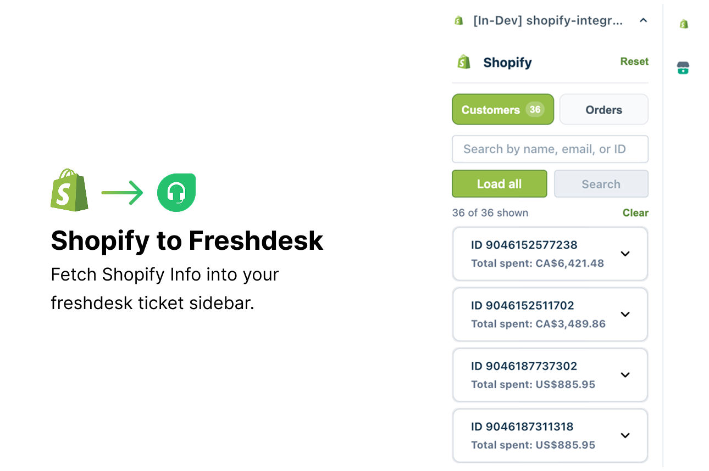
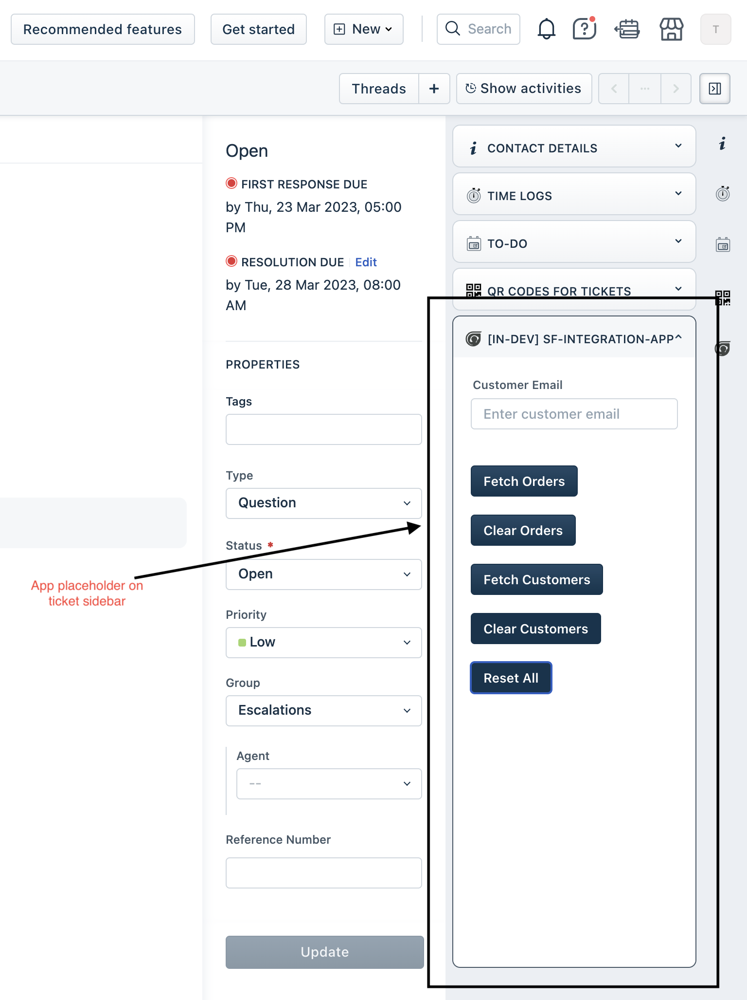
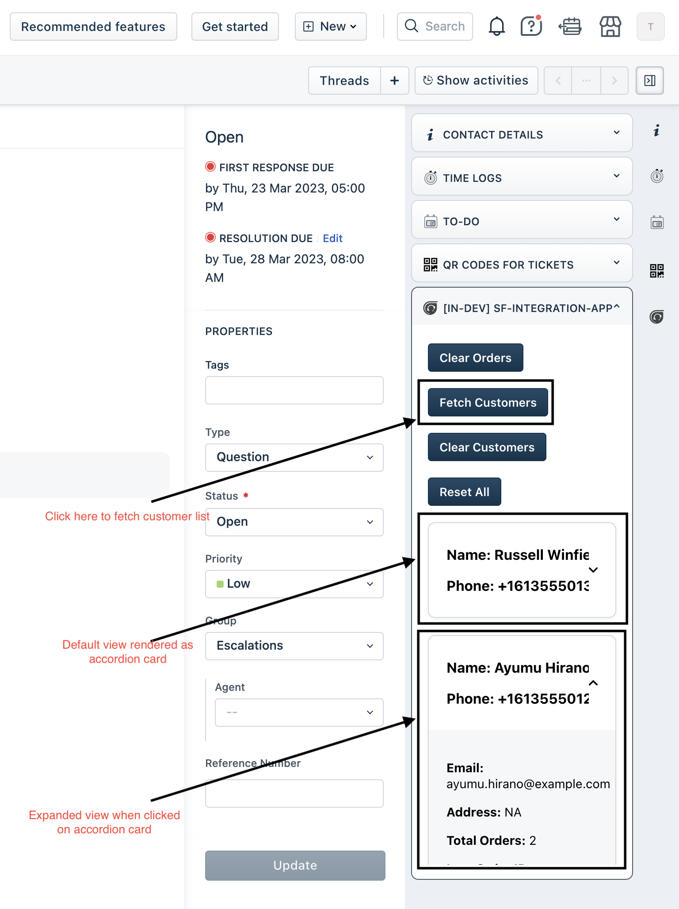
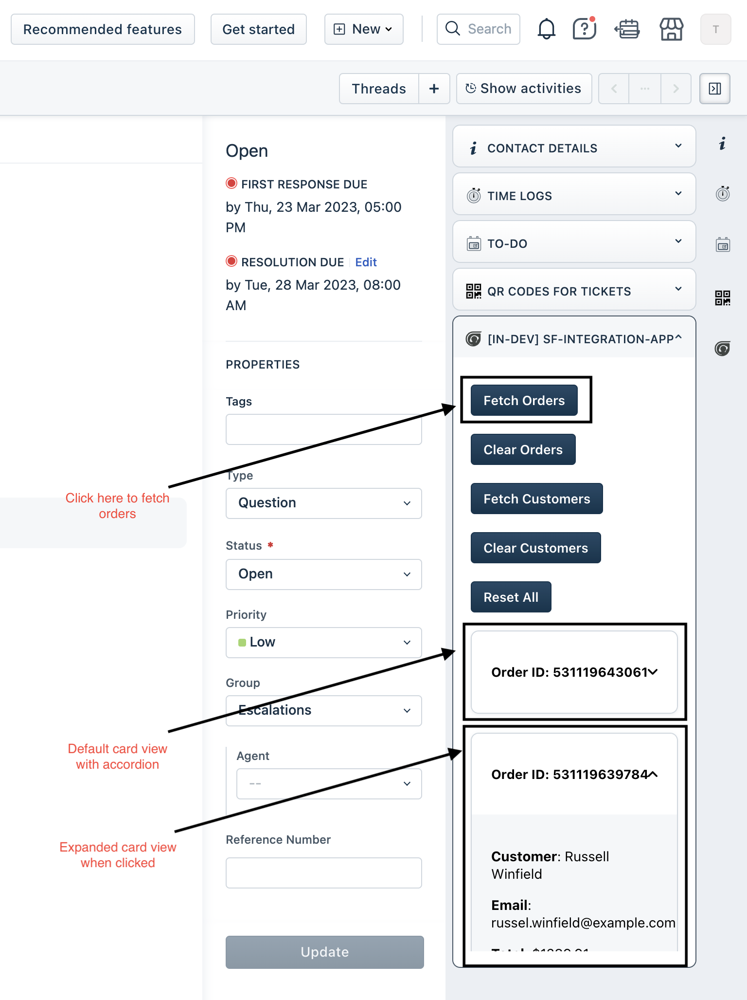

# Shopify Integration — Freshdesk



A **Freshdesk ticket sidebar** app that pulls **Shopify customers** and **orders** into the agent view. Built with [React Meta](https://developers.freshworks.com/docs/app-sdk/v3.0/support_ticket/front-end-apps/react-meta/), **Crayons React**, and Platform [request templates](https://developers.freshworks.com/docs/app-sdk/v3.0/support_ticket/advanced-interfaces/request-method/).

| | |
|---|---|
| **Platform** | 3.0 |
| **Framework** | React Meta |
| **Surface** | `ticket_sidebar` |
| **Node** | 24.11.1 |
| **FDK** | 10.1.2 |

---

## Description

StyleHub Retail agents resolve post-purchase tickets faster when Shopify order and customer data appears beside the Freshdesk thread. See [`usecase.md`](usecase.md) for the full StyleHub operational scenarios.

### Core Functionality

1. Look up **orders** by customer email via Shopify Admin REST API request templates
2. Browse and **search customers** as accordion cards with local filtering
3. Fetch a single order by **order ID** when email context is wrong or missing
4. **Paginate** large customer and order lists with load-more controls
5. Store Shopify credentials in secure **installation parameters** — tokens never reach the frontend

---

## User Interfaces

| Surface | Placement | Behavior |
| --- | --- | --- |
| `app/sidebar.html` | `support_ticket.ticket_sidebar` | Customers tab, orders tab, search, and fetch actions |

## Platform 3.0 Features Used

### 1. Request Methods — Shopify Admin REST API

`config/requests.json` defines `fetchCustomers`, `searchCustomers`, `fetchCustomerOrders`, `fetchOrderById`, and related templates. FDK injects `shopify_subdomain` and secure `shopify_access_token` at runtime.

### 2. Installation Parameters — Store Credentials

Subdomain and Admin API token are collected at install via `config/iparams.json`. The access token is marked secure and used only in request templates.

### 3. React Meta — Ticket Sidebar UI

`metaConfig.framework: "react"` bundles `ShopifyMain`, tab panels, and Crayons components through the FDK Vite pipeline.

### 4. Interface Methods — Agent Feedback

`client.interface.trigger('showNotify')` surfaces fetch errors and empty-result hints without leaving the sidebar.

### 5. Crayons UI Components

The app uses Freshworks Crayons v4 design system:

| Component | Usage |
| --- | --- |
| `FwButton` | Search, load, clear, and tab actions |
| `FwInput` | Customer and order search fields |
| `FwSpinner` | Loading states during Shopify fetches |
| `FwInlineMessage` | Inline status and error banners |
| `FwAccordion` / cards | Customer detail expansion |

---

## What it does

Agents on a ticket can:

- Look up **orders** by customer email ([Shopify Orders API](https://shopify.dev/docs/api/admin-rest/latest/resources/order))
- Browse **customers** as accordion cards ([Shopify Customers API](https://shopify.dev/docs/api/admin-rest/latest/resources/customer))
- Clear results or reset the form between lookups

Shopify calls use request templates (`fetchCustomers`, `fetchCustomerOrders` in [`config/requests.json`](config/requests.json)). Credentials are stored in [installation parameters](https://developers.freshworks.com/docs/app-sdk/v3.0/support_ticket/app-settings/installation-parameters/) — the access token is secure.

---

## Prerequisites

| Requirement | Link / notes |
|-------------|----------------|
| **Node.js 24.x** | [Node downloads](https://nodejs.org/) |
| **FDK 10.1.2** | [Freshworks FDK setup](https://developers.freshworks.com/docs/app-sdk/v3.0/common/freshworks-cli-setup/) |
| **Freshdesk dev account** | Your Freshdesk site URL (e.g. `https://acme.freshdesk.com`) |
| **Shopify store** | [Shopify Admin](https://admin.shopify.com/) with permission to create custom apps |
| **Admin API token** | Scopes: `read_customers`, `read_orders` — see [Step 1](#step-1--create-a-shopify-custom-app) |

---

## Step 1 — Create a Shopify custom app

Create a **custom app** in your store (not an embedded Partner app). The Freshdesk sidebar only needs an Admin API token — no App URL or OAuth redirect.

1. Open [Shopify Admin](https://admin.shopify.com/) → **Settings** → **Apps and sales channels** → **Develop apps**.
   - Docs: [Create and install a custom app](https://shopify.dev/docs/apps/build/dev-dashboard/create-apps-using-dev-dashboard)
2. Click **Create an app** (e.g. `Freshdesk integration`).
3. Under **Configuration** → **Admin API integration**, set **Admin API access scopes**:
   ```
   read_customers,read_orders
   ```
   - Scope reference: [Shopify access scopes](https://shopify.dev/docs/api/usage/access-scopes)
4. Click **Save**, then **Install app** on your store.
5. Open **API credentials** and copy:
   - **Admin API access token** (starts with `shpat_…`) — use this in Freshdesk, **not** the Storefront token
   - Your store subdomain from `your-store.myshopify.com` → subdomain is `your-store`

| Freshdesk iparam | Where to get it |
|------------------|-----------------|
| **Shopify sub domain** | `your-store` from `your-store.myshopify.com` |
| **Shopify Access Token** | Custom app → **API credentials** → **Admin API access token** |

---

## Step 2 — Install dependencies and validate

From this folder:

```bash
cd only-migration/shopify-integration
npm install
fdk config set global_apps.enabled true
fdk validate
```

`global_apps.enabled` is required because request templates are declared under `modules.common` — see [global app concepts](https://developers.freshworks.com/docs/app-sdk/v3.0/common/global-app-concepts/).

Expected: **0 platform errors**, **0 lint errors**.

---

## Step 3 — Run locally

```bash
fdk run
```

Keep this terminal running. The FDK serves the app and opens local developer tools.

| Local URL | Purpose |
|-----------|---------|
| [http://localhost:10001/custom_configs](http://localhost:10001/custom_configs) | Enter iparams (subdomain + token) |
| [http://localhost:10001/system_settings](http://localhost:10001/system_settings) | Account URLs and module subscription |
| [http://localhost:10001/web/test](http://localhost:10001/web/test) | Webhook / event testing (not used by this app) |

Docs: [Test your app](https://developers.freshworks.com/docs/app-sdk/v3.0/support_ticket/basic-dev-tools/freshworks-cli-setup/test-your-app/)

---

## Step 4 — Configure installation parameters

1. With `fdk run` active, open **[http://localhost:10001/custom_configs](http://localhost:10001/custom_configs)**.
2. Enter:
   - **Shopify sub domain** — e.g. `your-store`
   - **Shopify Access Token** — Admin API token from [Step 1](#step-1--create-a-shopify-custom-app)
3. Click **Save**.

These map to [`config/iparams.json`](config/iparams.json) and are substituted into [`config/requests.json`](config/requests.json) at runtime.

---

## Step 5 — Test in Freshdesk

1. Open your Freshdesk site with dev mode:
   - `https://<your-domain>.freshdesk.com/a/?dev=true`
   - If the URL already has query params, use `&dev=true` instead of `?dev=true`
2. When the browser prompts, **allow local network access** (required for `fdk run`).
3. Open any **ticket**.
4. In the right **Apps** panel, launch **Shopify Integration**.
5. Try:
   - Enter a customer email → **Fetch Orders**
   - **Fetch Customers** to list store customers
   - **Reset All** to clear the sidebar

---

## Screenshots

| View | |
|------|---|
| Ticket sidebar |  |
| Fetch Customers |  |
| Fetch Orders |  |

---

## UI actions

| Button | Action |
|--------|--------|
| **Fetch Orders** | Loads orders for the email in the input field |
| **Clear Orders** | Clears email and order list |
| **Fetch Customers** | Loads customer accordion cards from Shopify |
| **Clear Customers** | Removes customer cards |
| **Reset All** | Clears customers, orders, and status messages |

---

## Project structure

```
shopify-integration/
├── manifest.json                 # React Meta + request template declarations
├── package.json
├── app/
│   ├── sidebar.html              # ticket_sidebar entry
│   ├── components/               # ShopifyMain, ShopifyApp, CustomerCard, OrderCard
│   ├── utils/                    # shopify-api.js, validation.js
│   └── styles/
├── config/
│   ├── iparams.json
│   └── requests.json             # Shopify Admin API 2023-04
├── tests/
│   └── shopify-api.test.js
├── usecase.md
└── docs/
    ├── solution.md
    ├── app_dev_guide.md
    └── assets/shopify-api-collection.json
```

---

## Testing

```bash
npm test
fdk validate
```

Reset local installation parameters when re-testing iparams:

```bash
rm .fdk/store.sqlite
fdk run
```

---

## Key Learnings

1. **Secure tokens in templates only** — never pass `shopify_access_token` to React state; invoke request templates from the client.
2. **Global app requests** — declare templates under `modules.common` and enable `fdk config set global_apps.enabled true`.
3. **Pagination over bulk fetch** — use `since_id` and load-more for large Shopify catalogs instead of single giant responses.
4. **Validate before invoke** — check email and order ID format client-side to avoid needless 404/400 API calls.

---

## Troubleshooting

| Symptom | What to check |
|---------|----------------|
| **401 / request fails** | Correct subdomain and **Admin API** token; custom app installed on the store |
| **No customers** | Store has customers; scopes include `read_customers` |
| **No orders for email** | Email has orders in Shopify; scopes include `read_orders` |
| **global apps validation error** | Run `fdk config set global_apps.enabled true` |
| **App does not appear** | `fdk run` is running; URL has `?dev=true`; local network allowed |
| **Invalid scopes in Partner dashboard** | This app uses **store custom apps**, not embedded Partner OAuth — see [Step 1](#step-1--create-a-shopify-custom-app) |

---

## Related documentation

### Freshworks

- [Request method](https://developers.freshworks.com/docs/app-sdk/v3.0/support_ticket/advanced-interfaces/request-method/)
- [Installation parameters](https://developers.freshworks.com/docs/app-sdk/v3.0/support_ticket/app-settings/installation-parameters/)
- [Ticket sidebar placement](https://developers.freshworks.com/docs/app-sdk/v3.0/support_ticket/front-end-apps/app-locations/#ticket-sidebar)
- [Freshworks CLI — `fdk run`](https://developers.freshworks.com/docs/app-sdk/v3.0/common/freshworks-cli-setup/)

### Shopify

- [Custom apps in Shopify Admin](https://shopify.dev/docs/apps/build/dev-dashboard/create-apps-using-dev-dashboard)
- [Admin REST API — Customers](https://shopify.dev/docs/api/admin-rest/latest/resources/customer)
- [Admin REST API — Orders](https://shopify.dev/docs/api/admin-rest/latest/resources/order)
- [Access scopes](https://shopify.dev/docs/api/usage/access-scopes)

### Repo guides

- [Use case](usecase.md)
- [Solution walkthrough](docs/solution.md)
- [App development guide](docs/app_dev_guide.md)
- [Shopify API collection](docs/assets/shopify-api-collection.json)
