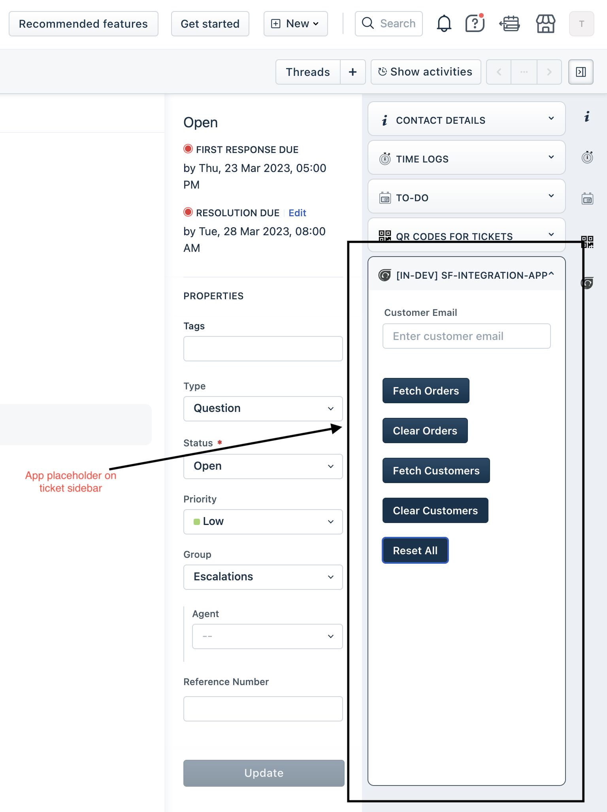
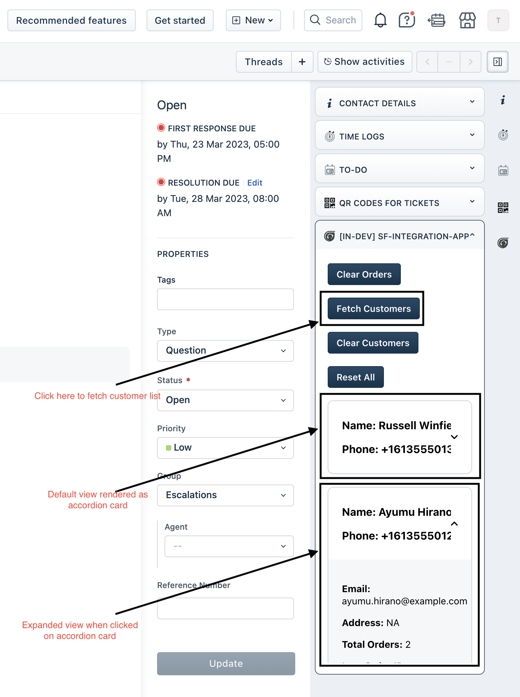
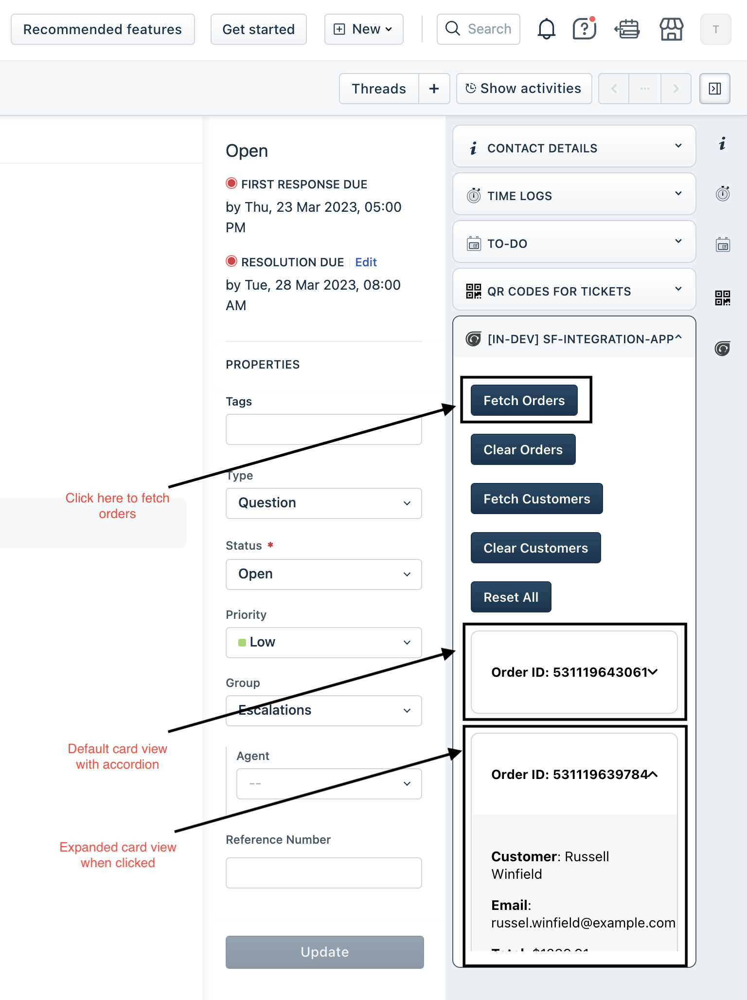

# Detailed Instructions for building app with given Shopify Usecase

1. Create installation page to capture the required details from Shopify app
2. Create Request method templates for the respective APIs
3. Create UI components write business logic for invoking those APIs
4. Test the app changes locally
5. Refactor and add code comments to your application
6. Perform security review of the application
7. Generate documentation for the feature built
8. Upload your app to AMP as an In development app and test the changes
9. Publish your app as a Custom app

Note: To build along use the [input queries](input_queries.md) listed in query prompts

The final app should look like below one

The Retrieve customer option should result in reponse like below one

The Retrieve order option should result in reponse like below one

